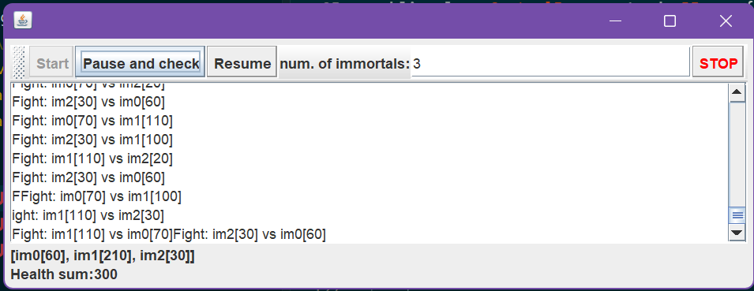
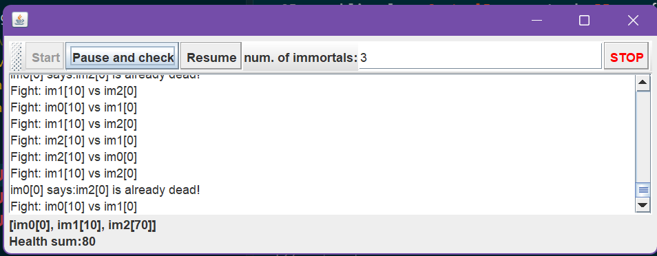
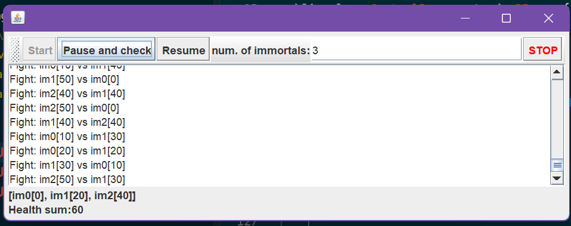
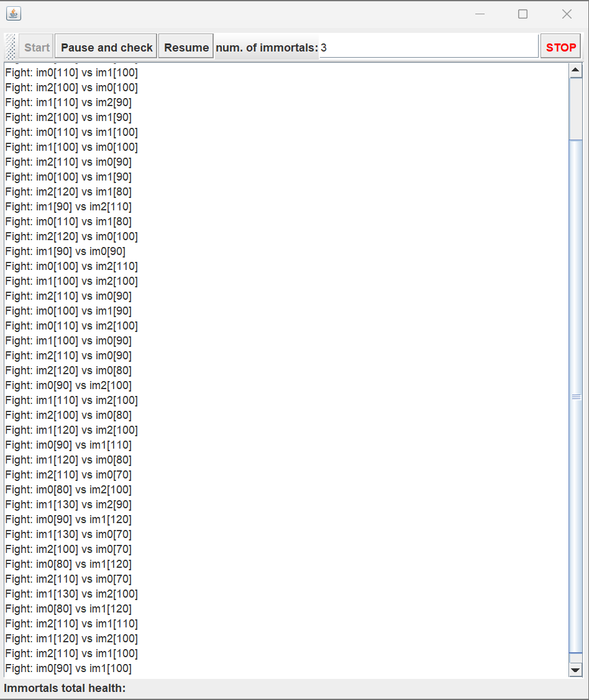

# Solución

# PARTE III

## 1. Revisando

Como parte más importante de este código, tenemos:

- N inmortales de la clase ```Immortal.java```, cada uno con su propio hilo
- Cada hilo conoce a todos los demás porque todos están el la lista ```inmortalsPopulation```
- en cada iteración, todos eligen a alguien aleatorio y pelea contra ese en ```figh()```
- como los hilos corren siempre, no hay parada, osea, el huego nunca termina con solo 1 ganador, al final casi todos quedan en 0

## 2. Invariante Jugadores

El invariante identificiado debería ser:

```Suma total = N * 100```
(en donde decimos que es 100 el valor de ```DEFAULT_IMMORTAL_HEALT```, la salud inicial de cada inmortal)

Esto porque, si observamos el metodo fight() desde la clase immortal tenemos:

```
i2.changeHealth(i2.getHealth() - defaultDamageValue);
this.health += defaultDamageValue;
```
En donde cada pelea posee su operación, se le quita el ```defaultDamageValue``` al i2 y se suma esa cantidad exacra a si mismo.

No se crea o destruye vida como tal en el sistema, sino que se realiza una transferencia entre todos los jugadores. Por tanto, en las cuentas de la suma total de vida de todos los inmortales existentes, debe de mantenerse constante durante toda la ejecución del juego, no importa cuantas peleas ocurran.

De esta manera, al tener para cada uno de los N inmortales un arranque de 

```
healt = DEFAULT_IMMORTAL_HEALT = 100 = N * 100
```

la invariante es 

```
Σ health(i) para i en immortalsPopulation = N * 100
```

es decir, si solo poseemos 3 inmortales (``` numOfImmortals = 3```) la suma siempre deberá de ser **300**, no importa las rondas dee combate que hayan.

Si en caso contrario, en algún momento entre clickear 'Pause and Check' esa suma cambia (sube o baja), es una evidencia de una condición de carrera en ```fight()``` porque las operaciones dentro, no son atomicas ni sincronizadas, cosa que si varios hilos las estan leyendo/escribiendo sobre el mismo inmortal, perderá actualizaciones.

## 3. Verificación 'Pause and Check'

Ejecutando el programa y haciendo varias pruebas con el 'pause and check' mientras el juego corre, observamos que el invariante **no se cumple de manera consistente**, ya que la suma de vida fluctúa contantemente (a veces está por encima de N * 100, otra veces esta debajo) en vez de mantenerse fija.

Por ejemplo:

***Primera pausa***



***Segunda pausa***



***Tercera pausa***



Y es que tal como se explicó en el punto anterior, las operaciones de este método no son atomicas. Con ello se presenta una ***condición de carrera de modificación/escritura*** entre los diversos hilos que representan a los inmortales, ya que pueden estar en el healt del mismo ```immortal``` sin ningún tipo de sincronización.

## 4. Corrigiendo Pause and Check

Para corregir esta implementación, en el código de [Immortal.java](../java/edu/eci/arsw/highlandersim/Immortal.java) hacemos lo siguiente:

- cada Immortal tiene una bandera ```pause``` protegido por un monitor (osea el ```this``` o un lock)
```
private final Object pause = new Object();
private volatile boolean paused = false;
private volatile boolean waiting = false;
```
- en cada vuelta que se tiene del while, antes de pelear, el hilo revisa si debe pausarse, si es así, genera un ```wait()```
```
    public void run() {
        while (true) {
            checkPaused();

            Immortal im;
            ...
```
Y también el el código [ControlFrame.java](../java/edu/eci/arsw/highlandersim/ControlFrame.java)
- el boton 'pause and check' pone el flag ```pause = true``` en todos los inmortales y espera un momento a que todos pasen a **wait()* antes de imprimir (para evitar leer sobre una operación)
```
    private void checkPaused() {
        synchronized (pauseLock) {
            ...
        }
    }

    public void pauseImmortal() {
        synchronized (pauseLock) {
            ...
        }
    }

    public void resumeImmortal() {
        synchronized (pauseLock) {
            ...
        }
    }

    public boolean pausedAndWaiting() {
        synchronized (pauseLock) {
            ...
        }
    }
```
---
```
    ...
        for (Immortal im : immortals) {
            im.pauseImmortal();
        }
    ...
```
- el boton 'Resume' pone a ```pause = false``` y hace ```notifyAll()``` a cada immortal
```
    public void actionPerformed(ActionEvent e) {
        for (Immortal im : immortals) {
            im.resumeImmortal();
        }
    }
...
```
Además de esas ideas, se realizó un ```synchronized()``` sobre los métodos: fight(), changeHealt() y getHealt().
Esto con el fin de que, aunque se pausen los hilos antes de leer, la condición de carrera en fight() sigue ahí mientras el juego corre normalmente.

Con la sincronización sobre ```this```, el ataque a un inmortal ahora será atómico frente a otros ataques al mismo objetivo.

## 5. Funcionamiento Nuevo. ¿Invariante Consistente?

No, el invariante **no se cumple de manera consistente**, y en algunos casos ni siquiera se puede llegar a verificar.
Al hacer clic repetidamente en "Pause and check" observamos dos problemas importantes:

1. **El invariante se rompe incluso antes de pausar:** Revisando el log de peleas, se encuentran sumas inconsistentes entre líneas consecutivas — por ejemplo, en una ejecución con 3 inmortales (invariante esperado = 300), se observan estados como ```im0[70] + im1[120] + im2[100] = 290```, estancandose con el valor esperado. Esto ocurre porque ```fight()``` realiza una operación sobre el ```health``` de ambos participantes sin ninguna sincronización (primero puede ser uno u otr, no tienen orde), por lo que dos hilos pueden pelear contra el mismo inmortal (o pelear mutuamente) al mismo tiempo y pisarse las actualizaciones entre sí.



2. **El programa eventualmente se detiene por completo (deadlock):** Een ese momento "Pause and check" queda colgado indefinidamente. Esto sucede cuando dos inmortales se atacan mutuamente al mismo tiempo (im0 ataca a im1 mientras im1 ataca a im0): cada hilo, dentro de ```fight()```, toma su propio lock (```this```) y luego intenta tomar el lock del rival (```i2```) para leer/modificar su salud. Si ambos hilos alcanzan a tomar su propio lock antes de intentar tomar el del otro, quedan esperándose mutuamente para siempre. Cuando esto ocurre, los hilos bloqueados nunca regresan al ciclo ```while(true)``` de ```run()```, por lo que nunca llegan al punto de revisión de pausa (```checkPaused()```), y el botón "Pause and check" (que espera a que todos los hilos confirmen que están pausados) se queda esperando sin éxito.

Con esto en mente, la implementación de pausa/resume del punto 4 es funcionalmente correcta en la lógica de ```wait()```/```notify()```, pero no es suficiente para garantizar ni verificar el invariante, porque el problema de fondo está en ```fight()```: una región crítica sin sincronización adecuada (que causa la condición de carrera) y, al intentar corregirla con locks simples, un riesgo latente de deadlock por adquisición de locks en orden inconsistente entre hilos que se atacan mutuamente.

## 6.

### Problemas encontrados

La región crítica de una pelea incluye la lectura de la salud del contrincante, la reducción de su salud y el aumento de la salud del atacante. Estas operaciones deben ejecutarse como una sola unidad, porque la salud total debe conservarse.

Sin sincronización, dos hilos pueden leer el mismo valor de salud y sobrescribir los cambios del otro, provocando una condición de carrera y perdiendo una actualización. Sin embargo, sincronizar únicamente `fight()` sobre `this` tampoco es suficiente: una pelea modifica dos objetos (`this` e `i2`). Además, si dos inmortales se atacan mutuamente, cada hilo puede tomar primero el lock de su propio objeto y quedar esperando el lock del otro. Esto produce un deadlock.

### Estrategia de bloqueo

Se utilizaron los propios objetos `Immortal` como locks, pero se estableció un orden global para adquirirlos. Como los nombres son únicos (`im0`, `im1`, etc.), antes de entrar a la región crítica se organizan los dos inmortales por nombre:

```
Immortal first = this;
Immortal second = i2;

if (first.name.compareTo(second.name) > 0) {
    first = i2;
    second = this;
}
```

Después se adquieren siempre en ese orden:

```
synchronized (first) {
    synchronized (second) {
        if (i2.health > 0) {
            i2.health -= defaultDamageValue;
            this.health += defaultDamageValue;
        }
    }
}
```

De esta manera, la lectura y modificación de las dos vidas quedan protegidas por los mismos locks. Si dos peleas comparten un inmortal, una espera correctamente a que termine la otra. Si no comparten inmortales, pueden ejecutarse simultáneamente, por lo que no se convierte toda la simulación en una única sección crítica.

El orden global evita el deadlock porque no puede existir una espera circular: todas las peleas que necesiten los mismos dos locks los solicitan en el mismo orden. Por ejemplo, tanto si `im0` ataca a `im1` como si `im1` ataca a `im0`, primero se bloquea `im0` y después `im1`.

Finalmente, el reporte se construye mientras ambos locks están adquiridos, pero se envía al callback después de liberarlos. Así se reduce el tiempo durante el cual los locks permanecen ocupados.

## 7. Verificación con `jps` y `jstack`

Al ejecutar el programa, no se observó que la aplicación se bloqueara ni que dejara de responder. Para comprobar el estado de los hilos se utilizó el comando `jps -l`, con el que se identificó el proceso de `ControlFrame` y su PID. Después se ejecutó:

```
jstack -l PID > thread-dump.txt
```


El archivo generado y leido con ayuda de una Inteligencia Artificial se revisó buscando mensajes como `Found one Java-level deadlock`, `BLOCKED` y `waiting to lock`. No se encontró ningún deadlock. Los hilos `im0` e `im1` aparecieron en estado `TIMED_WAITING`, detenidos temporalmente en `Thread.sleep(1)` dentro de `Immortal.run()`. Esto corresponde al funcionamiento normal de la simulación y no a un bloqueo entre locks.

Por lo tanto, en esta ejecución la aplicación nunca se bloqueó y el análisis con `jstack` confirmó lo observado visualmente. La IA ayudó a generar el archivo de volcado y a interpretar sus estados y mensajes, pero la evidencia corresponde a la ejecución real del programa y al resultado obtenido mediante `jps` y `jstack`.


## 8. Corrección del problema identificado

En la ejecución realizada no se presentó ningún deadlock ni bloqueo de la aplicación. El análisis del archivo generado con `jstack` confirmó que los hilos continuaban funcionando normalmente y que su estado `TIMED_WAITING` se debía únicamente al `Thread.sleep(1)` de la simulación.

Por esta razón, en este punto no fue necesario aplicar una corrección adicional. La estrategia de adquirir los locks en un orden global ya estaba implementada y permitió que la simulación continuara ejecutándose sin una espera circular. Por el momento no se identificó ningún problema adicional que reparar.